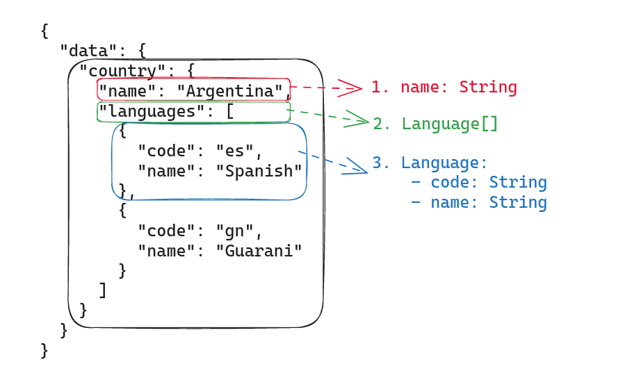

# GraphQL Query Builder for Java

## Example

Let's suppose that you have to communicate with an external api that uses GraphQL, for example [Countries](https://studio.apollographql.com/public/countries/variant/current/explorer) from ApolloGraphQL Studio.

In order to send a graphQL request with variables, you should send a **POST** with this body

Operation
```graphql
query Query ($countryCode: ID!) {
  country(code: $countryCode) {
    name
    languages {
      code
      name
    }
  }
}
```

Variables
```json
{
  "$countryCode": "AR"
}
```

Result
```json
{
  "data": {
    "country": {
      "name": "Argentina",
      "languages": [
        {
          "code": "es",
          "name": "Spanish"
        },
        {
          "code": "gn",
          "name": "Guarani"
        }
      ]
    }
  }
}
```


You can do that using this builder this way:

1. Create a DTO class that represents the fields you want to receive after transforming the response (with `ObjectMapper` for example)

In Java, it could be something like:

```java
public class Country {
    private String name;
    private List<Languages> languages;
    
    // Getters, Setters and toString()
}

public class Languages {
    private String code;
    private String name;

    // Getters, Setters and toString()
}
```

2. Build your GraphQLRequest by using GraphQLQueryBuilder

```java
private GraphQLQuery buildQuery(String code) {
        return GraphQLQueryBuilder.aGraphQLQueryBuilder()
        .addVariable("countryCode", GraphQLTypes.TYPE_ID, code, true, "code")
        .addFieldsStructureByClass(Country.class)
        .operationName("country")
        .build();
}
```

3. Use it in your client, for example:

```java
public class ApiCountriesClient {

    private static final String URI = "https://countries.trevorblades.com/graphql";

    public Country getResponse(String code) throws IOException {
        //Create client
        HttpClient httpClient = HttpClients.createDefault();
        HttpPost httpPost = new HttpPost(URI);
        httpPost.setHeader("Content-Type", "application/json");

        // Transform the query into JSON
        ObjectMapper objectMapper = new ObjectMapper();
        String json = objectMapper.writeValueAsString(buildQuery(code));
        httpPost.setEntity(new StringEntity(json));

        // Handle response
        HttpResponse response = httpClient.execute(httpPost);
        String jsonResponse = EntityUtils.toString(response.getEntity());
        GraphQLResponse<Country> countryResponse = objectMapper.readValue(jsonResponse, new TypeReference<>() {});
        return countryResponse.getData().get("country");
    }

    private GraphQLQuery buildQuery(String code) {
        return GraphQLQueryBuilder.aGraphQLQueryBuilder()
                .addVariable("countryCode", GraphQLTypes.TYPE_ID, code, true, "code")
                .addFieldsStructureByClass(Country.class)
                .operationName("country")
                .build();
    }
}

public class MainExample {

    public static void main(String[] args) throws IOException {
        ApiCountriesClient countriesClient = new ApiCountriesClient();
        Country country = countriesClient.getResponse("AR");
        System.out.println(country);
    }
}
```

The print from the terminal gives the following:

```
Country{name='Argentina', languages=[Languages{code='es', name='Spanish'}, Languages{code='gn', name='Guarani'}]}
```


